# IAM( Identity and Access Management )
* [Refer Here](https://www.freecodecamp.org/news/aws-iam-explained/) for better example how IAM user, Roles and Groups work.

AWS account root user
---------------------
* When you first create an Amazon Web Services (AWS) account, you begin with a single sign-in identity that has complete access to all AWS services and resources in the account. 
* This identity is called the AWS account root user and is accessed by signing in with the email address and password that you used to create the account.
  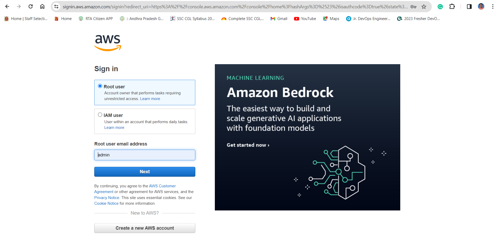
  
Enable a virtual MFA device for your AWS account root user (console)
--------------------------------------------------------------------
* You can use the AWS Management Console to configure and enable a virtual MFA device for your root user. To enable MFA devices for the AWS account, you must be signed in to AWS using your root user credentials.
* Before you enable MFA for your root user, review your account settings and contact information to make sure that you have access to the email and phone number. If your MFA device is lost, stolen, or not working, you can still sign in as the root user by verifying your identity using that email and phone number.
  
When do I use IAM?
------------------
### When you are performing different job functions

* How you use IAM differs, depending on the work that you do in AWS 
  
**Service user:** If you use an AWS service to do your job, then your administrator provides you with the credentials and permissions that you need. As you use more advanced features to do your work, you might need additional permissions. Understanding how access is managed can help you request the right permissions from your administrator.

**Service administrator:** If you're in charge of an AWS resource at your company, you probably have full access to IAM. It's your job to determine which IAM features and resources your service users should access. You must then submit requests to your IAM administrator to change the permissions of your service users. Review the information on this page to understand the basic concepts of IAM.

**IAM administrator:** If you're an IAM administrator, you manage IAM identities and write policies to manage access to IAM.

### When you are authorized to access AWS resources
* Authentication is how you sign in to AWS using your identity credentials. You must be authenticated (signed in to AWS) as the AWS account root user, as an IAM user, or by assuming an IAM role.
* You can sign in to AWS as a federated identity by using credentials provided through an identity source. 
* AWS IAM Identity Center (IAM Identity Center) users, your company's single sign-on authentication, and your Google or Facebook credentials are examples of federated identities. 
* When you sign in as a federated identity, your administrator previously set up identity federation using IAM roles. When you access AWS by using federation, you are indirectly assuming a role.
* AWS provides a software development kit (SDK) and a command line interface (CLI) to cryptographically sign your requests by using your credentials.
  
### When you sign-in as an IAM user
* An **IAM user** is an identity within your AWS account that has specific permissions for a single person or application.
* Where possible, it is recomendable to rely on temporary credentials instead of creating IAM users who have long-term credentials such as passwords and access keys
* An **IAM group** is an identity that specifies a collection of IAM users. You can't sign in as a group. 
* You can use groups to specify permissions for multiple users at a time. 
* Groups make permissions easier to manage for large sets of users. 
* For example, you could have a group named IAMAdmins and give that group permissions to administer IAM resources.
* Users are different from roles. 
* A user is uniquely associated with one person or application, but a role is intended to be assumable by anyone who needs it. 
* Users have permanent long-term credentials, but roles provide temporary credentials. 
  
### When you assume an IAM role
* An **IAM role** is an identity within your AWS account that has specific permissions. It is similar to an IAM user, but is not associated with a specific person.
* You can temporarily assume an IAM role in the AWS Management Console by **switching roles**. 
* IAM roles with temporary credentials are useful in the following situations:
   * **Federated user access**
   * **Temporary IAM user permissions:** An IAM user or role can assume an IAM role to temporarily take on different permissions for a specific task. 
   * **Cross-account access:** You can use an IAM role to allow someone (a trusted principal) in a different account to access resources in your account. Roles are the **primary way** to grant cross-account access. However, with some AWS services, you can attach a policy directly to a resource (instead of using a role as a proxy). To learn the difference between roles and resource-based policies for cross-account access, see [How IAM roles differ from resource-based policies](https://docs.aws.amazon.com/IAM/latest/UserGuide/id_roles_compare-resource-policies.html) in the IAM User Guide.
   * **Cross-service access:** Some AWS services use features in other AWS services.
       1. **Principal permissions:** When you use an IAM user or role to perform actions in AWS, you are considered a principal. Policies grant permissions to a principal.
       2. **Service role:** A service role is an IAM role that a service assumes to perform actions on your behalf. 
       3. **Service-linked role:** A service-linked role is a type of service role that is linked to an AWS service. The service can assume the role to perform an action on your behalf. 
   * **Applications running on Amazon EC2:** You can use an IAM role to manage temporary credentials for applications that are running on an EC2 instance and making AWS CLI or AWS API requests.
     * To assign an AWS role to an EC2 instance and make it available to all of its applications, you create an instance profile that is attached to the instance. 
     * An instance profile contains the role and enables programs that are running on the EC2 instance to get temporary credentials.  

### When you create policies and permissions

* You grant permissions to a user by creating a policy, which is a document that lists the actions that a user can perform and the resources those actions can affect. 
* Policies can be created and attached to principals (users, groups of users, roles assumed by users, and resources).

* These policies are used with an IAM role:

  **Trust policy** – Defines which principals can assume the role, and under which conditions. A trust policy is a specific type of resource-based policy for IAM roles. A role can have only one trust policy.

  **Identity-based policies** (inline and managed) – These policies define the permissions that the user of the role is able to perform (or is denied from performing), and on which resources.

### How does IAM works:

* [Refer Here](https://docs.aws.amazon.com/IAM/latest/UserGuide/intro-structure.html) for more info

### how can we set up cross-account access using IAM roles to allow users in one AWS account to access resources in another account?

* Target Account = Account A
* Source Account = Account B
1. Create an IAM Role in the Target Account (Account A):

   * Log in to the AWS Management Console of the account (Account A) where you want to grant access.
   * Go to the IAM console.
   * Navigate to "Roles" and click on "Create role."
   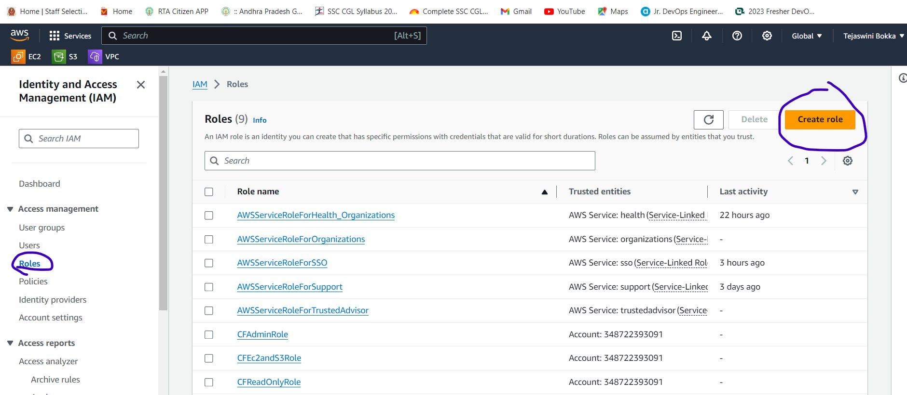
   * Choose "Another AWS account" as the type of trusted entity.
  * Enter the Account ID of the source account (Account B) that needs access
   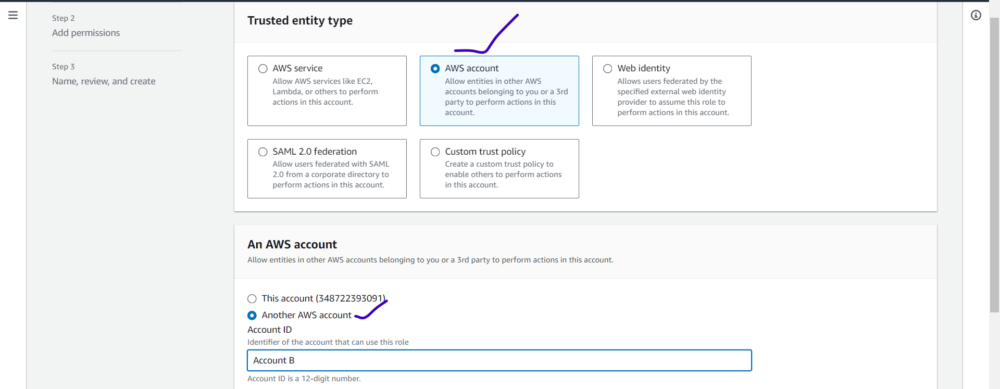
   
   * Attach policies to the role that define the permissions the role will have in the target account.
   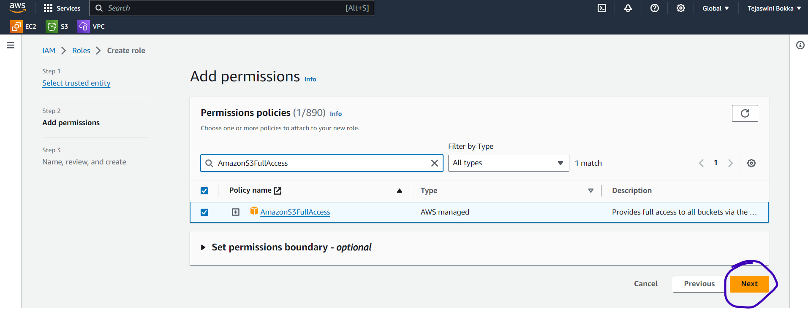
   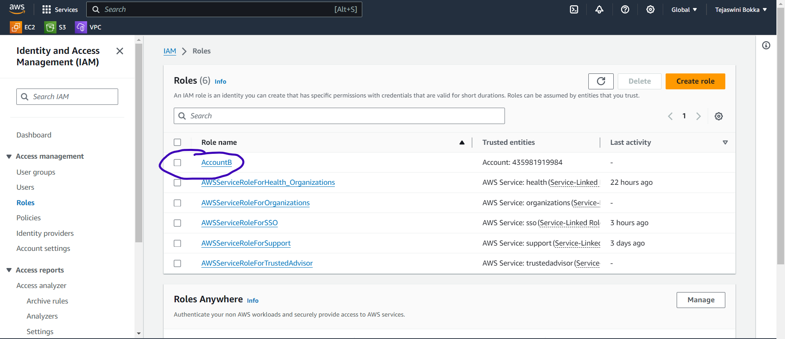
2. Set Permissions in the Source Account (Account B):
   * Log in to the AWS Management Console of the source account (Account B).
   * Navigate to IAM and create a policy that allows AssumeRole on the role created in the target account (Account A).
   * Attach this policy to the IAM user or role that needs access to resources in the target account.
  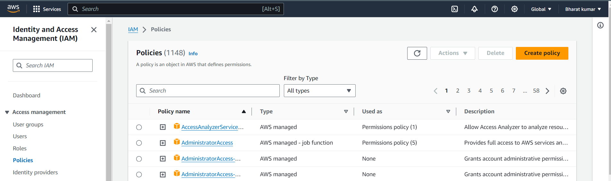
  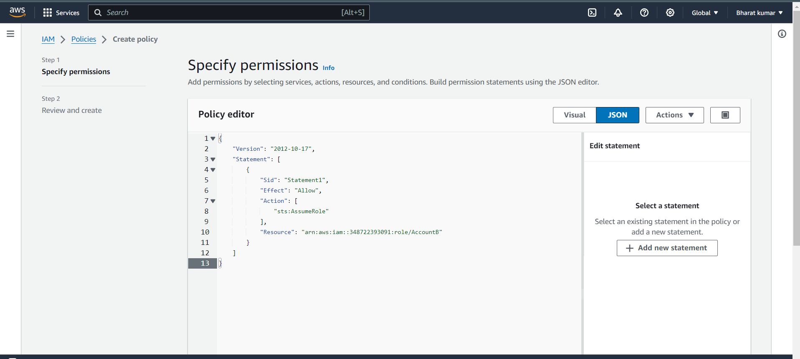
  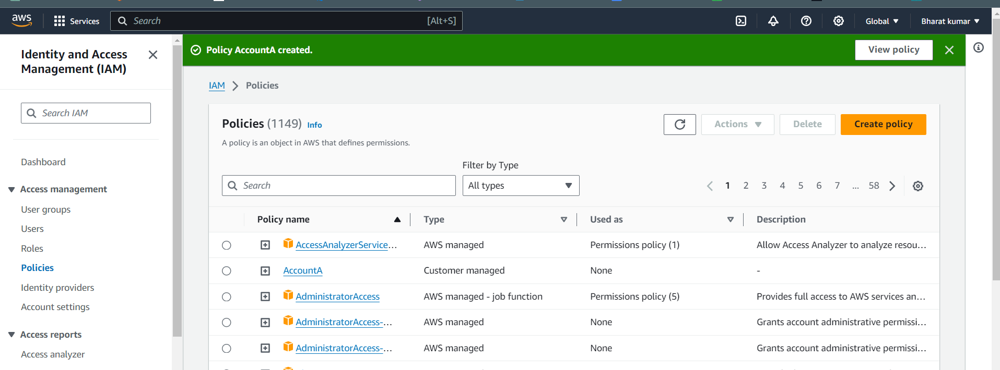
  * After creating a policy, create a user and attach the abive created policy to the new user.
  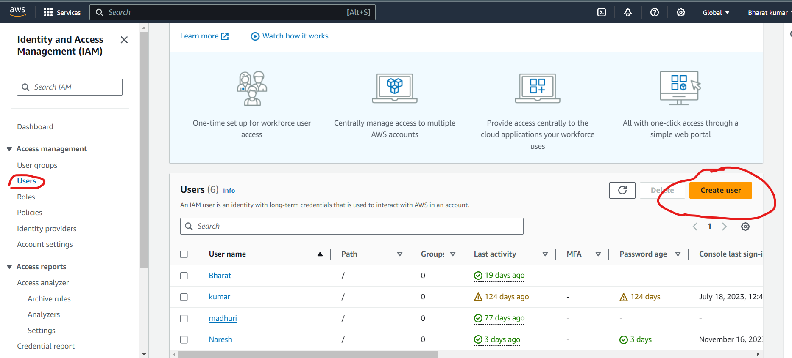
  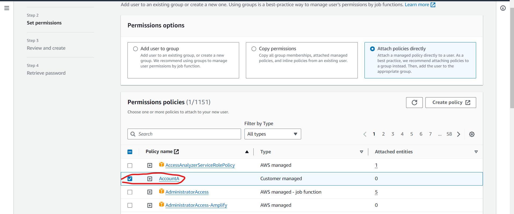
  * After creating user log into that user.
  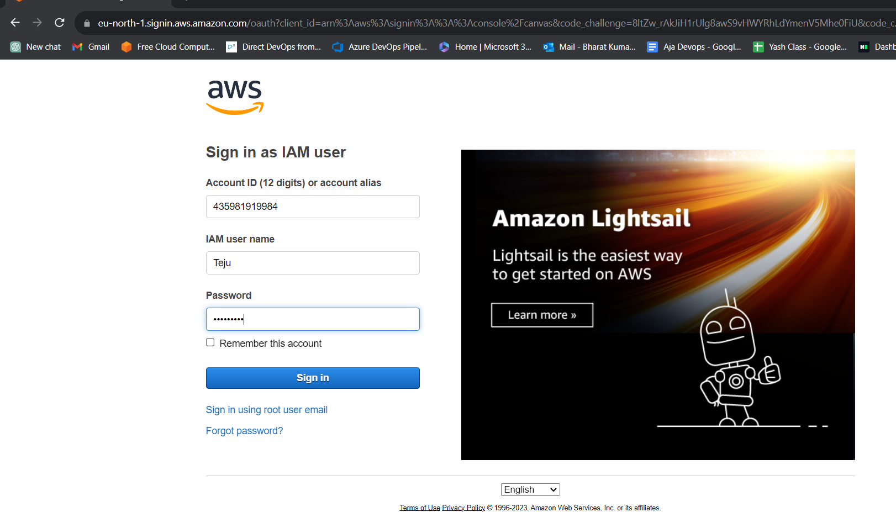
  * To access the Account A select switch role option.
  ![preview]images/(iam13.png)
  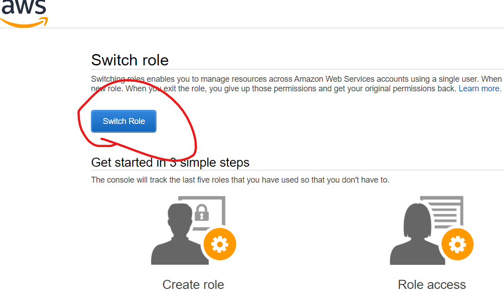
  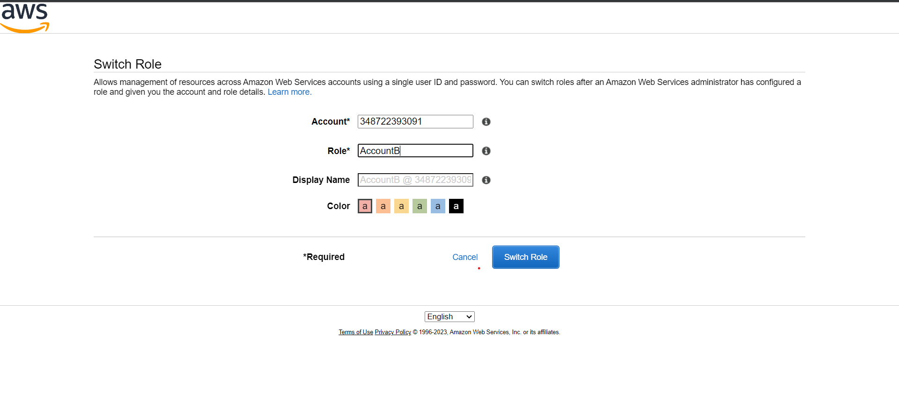
  * Here I have give Only S3 full access to the role so only s3 resorce can be accessed.
  ![preview]images/(iam16.png)
  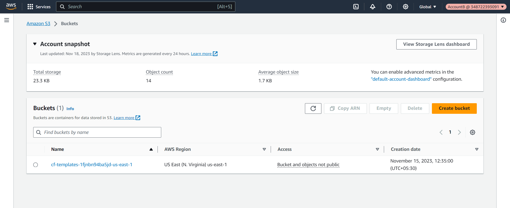
